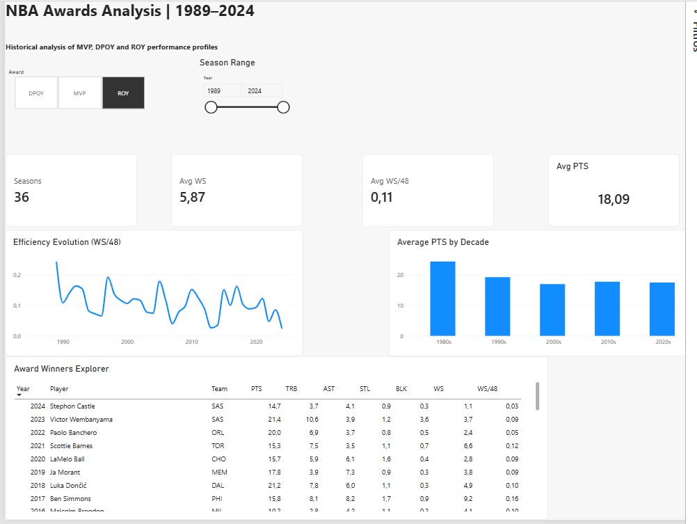

# 🏀 NBA Awards Analysis | 1989–2024

**Exploratory Data Analysis & Interactive Dashboard | Power BI • Excel**

This project analyzes historical NBA award winners from 1989 to 2024, focusing on **MVP (Most Valuable Player), DPOY (Defensive Player of the Year), and ROY (Rookie of the Year)**.

The objective is to explore how player performance profiles and award patterns have evolved over time, combining exploratory data analysis with an interactive Power BI dashboard.

Although based on sports data, the project demonstrates analytical skills that are directly transferable to business, product, and performance analytics: data preparation, metric definition, exploratory analysis, trend identification, visualization, and communication of insights.

---

## 📊 Power BI Dashboard

As an extension of the original Excel-based exploratory analysis, I developed an interactive Power BI dashboard to explore historical NBA award patterns and compare performance profiles across MVP, DPOY, and ROY winners.

The dashboard allows users to:

- Switch between MVP, DPOY, and ROY award categories
- Filter the analysis by season range
- Track key performance indicators across award winners
- Analyze changes in player efficiency over time
- Compare scoring trends across decades
- Explore individual award winners and their performance metrics

### Dashboard Preview

> The interactive Power BI dashboard is currently maintained locally. The preview above demonstrates its design, analytical structure, and main functionality.

---

## 🎯 Objectives

The project was designed to:

- Explore historical performance patterns among NBA award winners
- Compare MVP, DPOY, and ROY performance profiles
- Analyze the relationship between individual performance metrics and award outcomes
- Identify long-term trends across different NBA eras
- Build an interactive dashboard for exploratory analysis
- Demonstrate an end-to-end analytical workflow from data preparation to insight communication

---

## 📈 Metrics Analyzed

The analysis incorporates player and team performance indicators, including:

- Points per game (PTS)
- Total rebounds (TRB)
- Assists (AST)
- Steals (STL)
- Blocks (BLK)
- Win Shares (WS)
- Win Shares per 48 minutes (WS/48)

These metrics provide different perspectives on scoring, all-around contribution, defensive performance, and player efficiency.

---

## 🔎 Analytical Approach

The project follows a structured analytical workflow.

### 1. Data Preparation

Historical NBA player and award data were organized and prepared for analysis.

The dataset was reviewed to ensure that relevant seasons, award categories, player statistics, and performance metrics could be analyzed consistently.

### 2. Exploratory Data Analysis

Excel was used to explore the data, validate metrics, compare player performance, and investigate historical patterns.

The analysis focused on understanding how performance profiles differ across award categories and how these patterns have changed over time.

### 3. Metric Analysis

Key performance indicators were evaluated to understand different dimensions of player performance, including scoring, efficiency, defensive contribution, and overall impact.

### 4. Data Visualization

The analysis was extended into Power BI to make the results easier to explore interactively.

Filters, KPI cards, trend visualizations, decade comparisons, and a detailed winners table allow users to investigate the data from different perspectives.

### 5. Insight Communication

The final dashboard was designed to transform the analytical results into a clear and accessible format that supports exploration and interpretation.

---

## 💡 Dashboard Features

### Award Selection

Users can switch between:

- MVP
- DPOY
- ROY

This allows performance profiles to be compared across awards with different selection criteria.

### Season Range

An interactive season filter enables analysis across the complete 1989–2024 period or selected historical ranges.

### KPI Summary

The dashboard dynamically displays metrics such as:

- Number of seasons analyzed
- Average Win Shares
- Average WS/48
- Average points per game

### Efficiency Evolution

A historical trend visualization tracks **WS/48**, helping explore how the efficiency profiles of award winners have changed over time.

### Scoring by Decade

Average points per game are compared across decades to identify broader historical scoring patterns.

### Award Winners Explorer

A detailed table allows individual winners to be examined by season, team, and key performance metrics.

---

## 🛠️ Tools & Skills

### Power BI

- Interactive dashboard development
- KPI design
- Filters and slicers
- Data visualization
- Trend analysis

### Excel

- Data preparation
- Exploratory data analysis
- Data validation
- Metric analysis

### Analytical Skills

- Exploratory Data Analysis (EDA)
- Data cleaning and preparation
- Trend and pattern identification
- Performance analysis
- Data visualization
- Data storytelling

---

## 📁 NBA_Awards_Analysis_1989_2024

- `README.md` — project documentation
- `NBA_Awards_Analysis_1989_2024...` — main project file
- `imagens/`
  - `dashboard_overview.jpg` — Power BI dashboard preview

> **Note:** Replace `NBA_Awards_Analysis_1989_2024...` above with the exact filename shown in the repository.

---

## ⚠️ Limitations

This project is an exploratory analysis of historical NBA award data.

Award selection cannot be explained solely by the statistical metrics included in the dataset. Voting decisions may also reflect factors not captured in the analysis, including team context, player roles, narrative, voter preferences, and changes in how basketball has been played across different eras.

Therefore, the analysis should be interpreted as an exploration of historical patterns and performance profiles rather than a causal model of award selection.

---

## 🚀 Future Improvements

Potential extensions of the project include:

- Expanding the dashboard with additional advanced metrics
- Comparing award winners with other top-performing players from the same seasons
- Investigating relationships between team success and individual awards
- Adding additional contextual variables
- Extending the analysis to future NBA seasons

---

## 👤 Author

**Max Oppermann**

Data & Analytics professional with a background in engineering and experience in data analysis, business intelligence, data quality, and analytical problem-solving.
